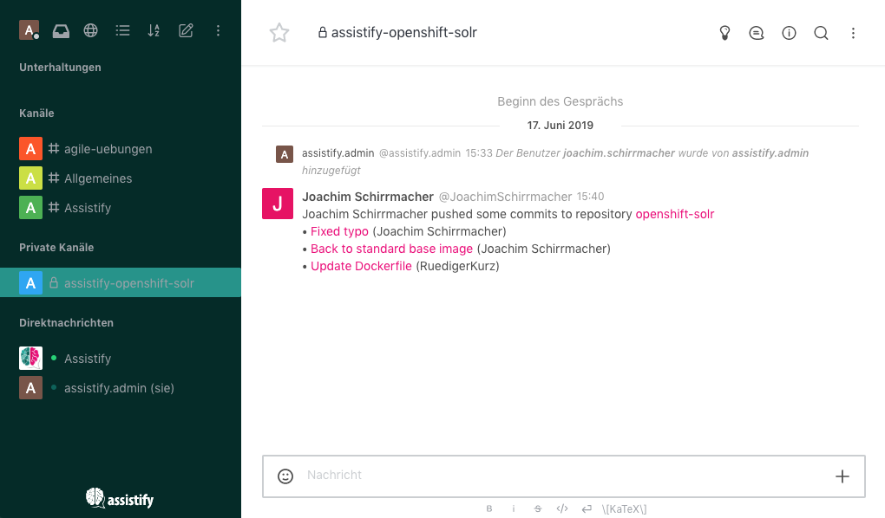
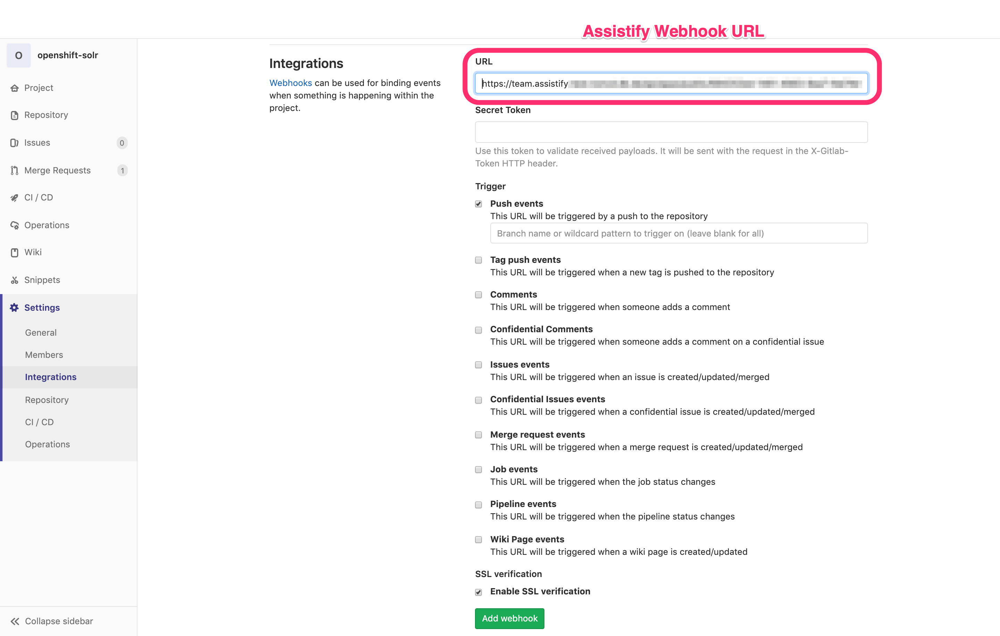

# Assistify - GitLab integration

_**Integrates GitLab with Assistify.**_

This app connects GitLab with Assistify. Users are notified directly in the Assistify chat about code changes and the current build status. In addition, this app allows users to reference, browse and create issues in the chat.



## Installation

### Preconditions

1. **Activate the app framework and development mode** - Therefore goto to the Rocket.Chat Admin UI -> Settings -> General -> Apps and enable both options "app framework" and "development mode".

2. **Install "Rocket.Chat Apps CLI"** - In order to make a deployable Rocket.Chat app from this repository, you need to install the "Rocket.Chat Apps CLI" first. See https://github.com/RocketChat/Rocket.Chat.Apps-cli for installation details.

### Deploy the App

After the RC Apps CLI has been  installed on your computer, checkout this repository and run `rc-apps package` in order to generate a packaged app file (zip) which can be installed. To deploy the app locally or remotely use the `rc-apps deploy` command: this will do what `package` does but ask you for your server url, username, and password to deploy the app for you.

```
git clone https://github.com/assistify/rcapps-gitlab.git
cd rcapps-gitlab
rc-apps deploy
```


## Configuration
To connect your GitLab project with Assistify you have to do a few steps on both sides:

* create and configure an integration within your GitLab project,
* disclose the GitLab URL in Assistify and finally
* create an Assistify channel to be used for notifications

### Connect GitLab code repository with Assistify

1. Switch to the Assistify Adminstration, open the _Apps_ settings and make sure the GitLab app is activated
2. Copy the _Assistify webhook URL_, enter the _GitLab base URL_ (e.g. https://gitlab.mycompany.com/),  and save your changes
   
3. Switch to the settings of your GitLab project (group > project > settings) and create a new integration
4. Paste the previously copied "POST webhook" URL, activate the trigger "Push events", scroll down and press "Add webhook"
   

More info about how to setup an integration (webhook) in GitLab, you'll find at: 
- https://docs.gitlab.com/ee/user/project/integrations/webhooks.html.

### Configure a notification channel

Now you need a channel where the GitLab notifications should appear. This must have the same name as the GitLab repository. For example, if your GitLab URL is https://gitlab.mycompany.com/assistify/chat, the channel in Assistify must be named `assistify-chat`. Make sure that slashes from the URL are replaced by hyphens.

**Note:** Ideally, you should use the same usernames in GitLab and Assistify. Then the user who triggered the event in GitLab will be used as the sender of the notifications in Assistify. The integration works even if the channel does not have the same name. However, the name of the sender of the notifications is always "Assistify.Admin".


## References

### Releated documentation

- [Rocket.Chat Apps CLI documentation](https://github.com/RocketChat/Rocket.Chat.Apps-cli)
- [GitLab WebHook documentation](https://docs.gitlab.com/ee/user/project/integrations/webhooks.html)

### Developing Rocket.Chat apps
Here are some links to examples and documentation:
- [Rocket.Chat Apps TypeScript Definitions Documentation](https://rocketchat.github.io/Rocket.Chat.Apps-engine/)
- [Rocket.Chat Apps TypeScript Definitions Repository](https://github.com/RocketChat/Rocket.Chat.Apps-engine)
- [Example Rocket.Chat Apps](https://github.com/graywolf336/RocketChatApps)
- Community Forums
  - [App Requests](https://forums.rocket.chat/c/rocket-chat-apps/requests)
  - [App Guides](https://forums.rocket.chat/c/rocket-chat-apps/guides)
  - [Top View of Both Categories](https://forums.rocket.chat/c/rocket-chat-apps)
- [#rocketchat-apps on Open.Rocket.Chat](https://open.rocket.chat/channel/rocketchat-apps)
